# iot-winapp-2025
IoT 개발자 C#/WinApp 리포지토리 2025

## 1일차

### C# 시작전에
- Visual Studio Installer 확인

    - `ASP.NET 및 웹 개발`, `.NET 데스크톱 개발`, 필수
    - .NET Multi-Platform App UI 개발, 옵션

    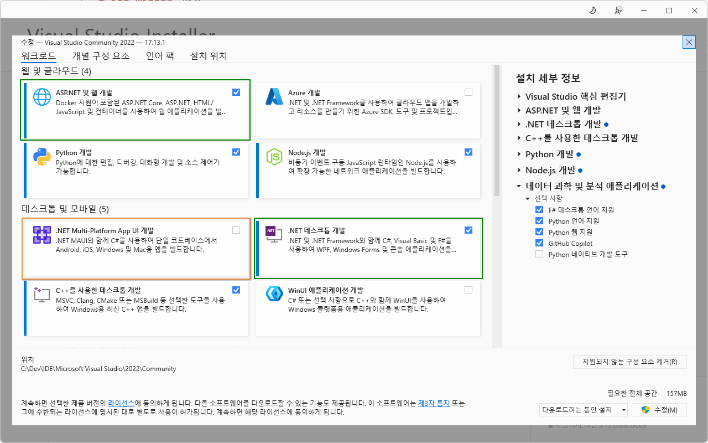

### C# 학습

#### C#이란?
- C#(씨샵) : **마이크로소프트**가 개발한 객체지향 프로그래밍 언어
    - 1991년, 귀도 반 로섬이 Python을 개발(1989년 시작)
    - 1985년, 비야네 스트롭스트룹이 C++을 개발(너무 어려움, 1980년 초반 개발시작)
    - 1995년, 제임스 고슬링이 Java를 개발(C++의 문법을 기반, 좀 더 쉬운 언어, 1991년 개발 시작)
    - MS가 썬 마이크로시스템즈와 라이센스 채결 후 MS용 Java인 J++를 개발. 특허권 소송 발생
    - 1999년, 파스칼, 델파이를 개발한 `앤더스 헤일스버그`가 C++, Java를 기반으로 C#을 개발
    - 2000년, C# 발표
    - 2025년, C# 13.0

- C# 특징
    - 닷넷 플랫폼 위에서 동작(Managed C++, C#, Java, Python, ...)
    - 문법이 Java와 상당히 유사. C/C++ 언어 난이도가 낮음
    - Java와 달리 unsafe mode를 사용하면 C/C++ 포인터 기능을 사용 가능
    - 런타임 시 `쓰레기 수집(Garbage Collection)`으로 자동으로 메모리 관리

- C# 유머
    - 1999년 앤더스 헤일스버그가 최초 Cool(C-like Object Oriented Language)로 이름을 생성
    - C#의 의미는 C++보다 개선된 언어의 의미로 C++++, 또는 음악에서 #이 원래 음보다 반음 높음을 뜻

- C# 버전
    - C# 1.x - 2002 ~ 2003년. .NET Framework 1.x 문제 많음
    - C# 2.x - 2006년. .NET Framework 2.x 개선이 많이 됨
    - C# 3.x - 2007년. .NET Framework 2.x~3.5 Java와 차이가 많아짐
    - C# 4.x - 2010년. .NET Framework 4.x C#의 기반
    - ...
    - C# 6.x - 2015년. .NET Framework 4.6, .NET Core 1.x(리눅스)
    - C# 7.x - 2017~2018년. .NET Framework 4.7, .NET Core 2.x
    - ...
    - C# 9.0 - 2020년, `.NET 5.0`(Framework, Core 통합)
    - C# 10.0 - 2021년, .NET 6(소수점 삭제)
    - C# 11.0 - 2022년, .NET 7
    - C# 12.x - 2023년, .NET 8
    - C# 13.x - 2024년 11월, .NET 9 (Visual Studio 2022에서 동작)

- 호환성, 범용성
    - 초기 Windows OS에서만 동작, OS플랫폼 독립적인 Java보다 범용성이 낮았음
    - 2016년부터 리눅스 공식지원. macOS에서도 사용 가능. 오픈소스 공표
    - 유니티 엔진 기본언어, Xamarin(이후 MAUI로 변경)로 모바일 개발 가능
    - 리눅스 Mono라는 닷넷 개발 프로젝트 -> 후에 MS에 흡수됨

#### .NET Framework(.NET)
- `CLR(Common Langauage Runtime)` 클래스를 사용하는 가상 머신. 예로 C#과 Java로 동시에 개발 가능
- Java의 JVM과 유사한 개념
- 언어가 발전하면서 필요한 기능이 늘기때문에 .NET Framework도 버전업을 계속함
- 2015년 리눅스 지원 개발시부터 .NET Framework가 너무 윈도우 구조에 너무 토착되다보니 새로운 프레임워크가 필요함
- .NET Core - 리눅스 지원용 만든 .NET [Framework]
- .NET Core와 .NET Framework 가 혼용
- 2020년 .NET Core와 .NET Framework를 통합해서 .NET 5.0 공표. 이 이후부터 Framework. Core 이름 사라짐
- C# 버전과 .NET 버전 숫자 차이나기 시작

- .NET 데스크톱 개발을 설치하면 C#, Visual Basic, F# 등 여러언어를 사용가능

- `C# 12.0`, `.NET 8`, `Visual Studio 2022` Community Edition에서 학습

## 2일차
- WinApp으로 문법 학습. 문법학습 후 WPF로 이전

### 새 프로젝트(콘솔) 만들기
- 순서
    1. 새 프로젝트 만들기
        - 언어 : C#
        - 플랫폼 : 모든 플랫폼
        - 프로젝트 : 콘솔 선택(데스크톱, 웹, 콘솔 중)
    2. 새 프로젝트 구성
        - 프로젝트 이름, 위치, 솔루션 이름
        - 솔루션 및 프로젝트를 같은 디렉토리에 배치 체크박스 해제 : 솔루션 내에 여러 프로젝트를 관리
    3. 추가 정보
        - 프레임워크 : .NET 8.0 (장기지원) 선택
        - LTS(Long Term Support) : 개발자가 기능,보안 업데이트를 지원
        - 최상위 문 사용 안함 체크박스 선택
    4. 스케폴딩 후 IDE 오픈

### 새 프로젝트(테스크톱, 윈앱) 만들기
- 아직 멀티플랫폼은 지원 안됨(Windows 만 지원)
- Windows Forms(문법학습) : 가장 오래된 윈앱 개발
- WPF(실습) : 좀더 디자인적으로 뛰어난 윈앱 개발
- 순서
    1. 언어, 플랫폼, 프로젝트 선택
        - 언어 : C#
        - 플랫폼 : 모든 플랫폼
        - 프로젝트 : 테스크톱 선택
    2. Windows Forms 앱 선택 (.NET Framework가 안 적힌 것)
    3. 프로젝트 명 입력
    4. 추가 정보
        - 프레임워크 : .NET 8.0 (장기지원) 선택        

- 프로젝트 구조
    - 종속성 : 필요모듈 추가, 관리, 삭제
    - Form1.cs : 윈폼 앱 개발 로직
        - Form1.Designer.cs : 실제 디자인 소스코드
        - Form1.resx : 아이콘, 이미지, 리소스문자열 관리 파일
    - Program.cs : 시작 프로그램 소스. 지우면 안됨

### 솔루션 관리
- 하나의 솔루션에 여러개 프로젝트가 있으면 시작 프로젝트가 선별되어야 함
- 굵은 글씨체로 나오는 프로젝트가 시작 프로젝트
    1. 시작 프로젝트로 변경할 프로젝트 > 마우스 오른쪽 > 시작 프로젝트로 설정
    2. 전체 솔루션 > 속성 > 속성 페이지
        - 시작 프로젝트 구성 메뉴 > 현재 선택 영역 선택

- 전체 솔루션 : *.sln(전체 솔루션 관리)
    - 프로젝트파일(C#) : *.csproj
    - 프로젝트파일(CPP) : *.vcxproj

- debug/release 모드
    - debug : 개발시 사용모드, 디버깅 로그, 디버깅을 위주
    - release : 배포시 사용모드. 프로그램 최적화, 성능 업

### 윈폼 앱/ 윈앱 개발순서
1. Form1.cs 이름 변경 : FrmMain.cs
    - 변경 시 `모든 참초 이름도 바꾸시겠습니까?` 메시지 창
        - 반드시 `예` 선택!
2. FrmMain.cs [디자인] 클릭 오픈
    - 마우스로 크기 조정
3. 속성 창(F4) 오픈, 솔루션 탐색기 아래쪽 드래그 후 붙이기
4. PyQt Designer와 거의 유사
    - FrmMain 속성 창 > Text > Form1 글자를 변경 후 엔터
    - size 속성 > Width, Height를 직접 수정
    - StartPosition > CenterScreen으로 변경
    - MaximizeBox > False
    - FormBorderStyle > Sizable -> FixedSingle로 변경
5. 보기 > 도구 상자 클릭
    - 공용 컨트롤 > Button 드래그
    - 더블클릭, 클릭으로 선택 후 폼에서 왼쪽버튼 누르고 드래그 등 다양

6. 속성 창 - 드롭다운 컨트롤에서 선택 > 여러 클래스 리스트

7. button1 속성 변경
    - (Name) > button1 -> BtnMsg 로 변경
    - Size 조정
    - Text > button1 -> 메시지 로 변경

8. 중간마다 Ctrl + S(저장), Ctrl+Shift+S(모두 저장) 눌러서 저장 습관

9. 속성 창의 이벤트아이콘(번개표시) 클릭
    - Click에 선택 되어 있음
    - 버튼의 경우, 버튼클릭이 기본 이벤트 
    - Click 오른쪽 빈공간을 더블클릭 
    - 버튼을 클릭했을 시 처리할 이벤트 메서드가 자동 생성

10. 새로 만든 컨트롤을 더블클릭
    - 이벤트 메서드가 자동 생성
    - 최초에 아무런 이벤트가 없을 때 기본 이벤트 메서드 생성

11. 오류 발생
    - 폼 디자인의 컨트롤 이벤트와 로직 코드 상의 이벤트 처리 메서드 생성 상 불일치로 발생
    - 이벤트 이름은 생성되고, 이벤트 정의 메서드는 생성이 안되서

    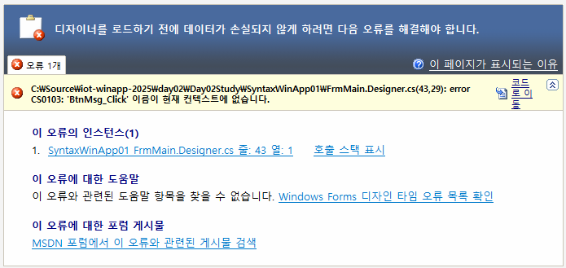

    - FrmMain.Designer.cs 파일 오픈
    - Windows Form Designer generated code를 확장
    - 오류난 이벤트 이름 삭제
        - BtnMsg.Click += ....
        - BtnOk.Click += ...

12. MessageBox.show() 작업
    - MessageBoxIcon.Warning, MessageBoxIcon.Error 사용시 알람 사운드 발생

13. 폼 디자이너 화면과 코드 상 전환
    - F7(코드 보기), Shift+F7(디자인 전환)

14. VS에서 더블클릭 함부로 하지 말것!!!
    - 이벤트 메서드 생성, 컨트롤 자동 생성, 폼 디자인 표시 등에서만 사용

15. 두 개 이상의 컨트롤 선택 후 Ctrl키 누른 상태에서 드래그하면 그룹으로 복사

### 윈앱 컨트롤1
- `Button` : 마우스 클릭위한 컨트롤
    - 보통 Btn~ 으르 시작
    - `(Name)` : 소스코드상에서 접근, 사용
    - Enabled : 사용여부
    - Location : 폼상의 위치 (x, y)
    - Size : 버튼 크기 (w, h)
    - TabIndex : 실행 후 탭으로 포커스가 가는 순서(레이블에는 포커스 안감)
    - Text : 버튼 표시 글씨    
    - Visible : 화면 표현여부
    - **Click** : 버튼 클릭 이벤트 처리 메서드 연결

- `Label` : 화면상의 글자만 표현하는 컨트롤
    - 보통 Lbl~ 로 시작
    - Button 컨트롤과 동일
    - 이벤트 거의 사용하지 않음

- `TextBox` : 텍스트 입력을 위한 컨트롤
    - 보통 Txt~ 로 시작
    - Button 컨트롤과 동일
    - BorderStyle : 컨트롤 테두리 속성 변경
        - None : 테두리 없음
        - FixedSingle : 검은색 테두리
        - Fixed3D : 입체감있는 테두리
    - MaxLength : 최대 몇자까지 적을 수 있는지
    - Multiline : 여러줄 사용여부. true가 되어야 높이 조절 가능
    - PlaceholderText : 입력전 입력내용 표시
    - ReadOnly : 입력을 가능 여부, true는 입력불가
    - **TextChanged** : 글자가 변경되면 발생하는 이벤트
    - **KeyPress** : 키보드 입력이 생기면 발생하는 이벤트

- `ComboBox` : 여러개 중 아이템을 선택하는 컨트롤
    - 보통 Cbo~ 로 시작
    - Button 컨트롤과 속성은 동일
    - Items(Collection) : 필요한 아이템 할당
    - **SelectedIndexChanged** : 선택한 아이템 순번이 바뀔때 발생하는 이벤트    
    - **SelectedValueChanged** : 선택한 아이템 값이 바뀔때 발생하는 이벤트

- `RadioButton` : 여러개중 하나만 선택하는 컨트롤
    - 보통 Rdo~ 로 시작
    - Button 컨트롤과 속성은 동일
    - Checked : 체크여부
    - 보통 이벤트 사용하지 않음

### C# 문법
- 기본 문법 - C++, Java와 거의 동일. C++와의 차이점만 비교
    1. 기본구조 및 주석 - [소스](./day02/Day02Study/ConsoleApp2/Program.cs)
        - 네임스페이스, 클래스, 메서드 

        ```cs
        namespace ConsoleApp2
        {
            /// <summary>
            /// 프로그램 클래스
            /// </summary>
            internal class Program
            {
                /// <summary>
                /// 주석 - XML 주석. 소스코드 자동 문서 생성시 사용.
                /// </summary>
                /// <param name="args">입력파라미터</param>
                static void Main(string[] args)
                {
                    // 주석 - 한 줄 주석
                    Console.WriteLine("Hello, World!");
                    /*
                    * 주석 - 여러 줄 주석
                    * 여러줄을 작성할 때 편리
                    */
                }
            }
        }

        ```
    2. 자료형과 변수, Nullable - [소스](./day02/Day02Study/SyntaxWinApp01/FrmMain.cs)
        - 변수 사용은 C++과 유사
        - 자료형도 C++ 유사, 닷넷타입이 더 추가됨
        - 닷넷타입은 여러언어에서 공통으로 사용위해서 추가된 기능
        - Nullable : 특수타입. 데이터타입뒤에 ? 추가. null 할당 가능
        - var타입 : 지역변수에서 타입을 동적으로 지정. 컴파일시 해당 타입으로 자동 지정
            - 지역변수만 가능(전역변수 사용불가)
            - 한번 타입이 지정되면 다른 타입으로 변경불가

    3. 연산자 - [소스](./day02/Day02Study/SyntaxWinApp02/FrmMain.cs)
        - C, C++ 과 동일! 패스!!

    4. 분기문, 반복문 - [소스](./day02/Day02Study/SyntaxWinApp03/FrmMain.cs)
        - if문
        - switch문
        - for문
        - foreach는 컬렉션에서...
        - while문

        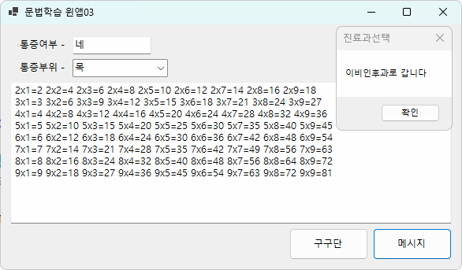
    
## 3일차

### Visual Studio Tip
- 가장 많이 사용할 단축키 : Alt + Enter

### 한글문제
- 한글 깨지는 문제
    - 콘솔 > Program.cs : UTF8 BOM 저장
    - 윈앱 > FrmMain.cs : EUC-KR(CP949) -> 깃헙에서 한글이 깨져서 나옴

- 각 IDE별 한글 깨짐 해결방법
    - VS Code > 오른쪽 하단 상태표시줄 UTF-8 클릭 인코딩 하여 다시 열기 또는 인코딩하여 저장 실행
    - VS > 다른이름으로 저장 > 인코딩하여 저장 > UTF-8 선택 저장
- 깃 리포지토리 
    - .git > config 문서에티터로 오픈

    ```ini
    [i18n]
        commitEncoding = utf-8
        logOutputEncoding = utf-8
    ```

### 윈앱 컨트롤2
- 모든 컨트롤은 `Control` 클래스를 상속
- `MaskedTextBox` : 사용자에게 주어진 형태로만 입력을 하도록 강제하는 텍스트입력컨트롤
    - 텍스트박스와 동일하게 Txt~ 로 시작
    - Button 컨트롤과 속성 동일
    - Mask : 사용자에게 입력제약할 포맷

- `GroupBox` : 관련있는 컨트롤들을 묶어주는 컨트롤
    - 이름을 0.1% 정도 변경
    - Button 컨트롤과 속성 동일
    - Text 속성만 사용

- Button 이미지 추가 
    1. 각 폼별 리소스 사용
        - 속성 Image : ... 버튼
        - 리소스 선택 > 로컬 리소스 > 가져오기
        - FrmMain.resx에 저장
    2. 폼위에 `ImageList` 컨트롤 사용
        - 도구 상자 ImageLisst 컨트롤 드래그
        - 폼에 표현되는 컨트롤 아님
        - 이미지 사이즈를 개발자 조정가능
    3. 전체 리소스에 추가
        - Properties > Resources.resx
        - 속성 Image : ... 버튼
        - 리소스 선택 > 프로젝트 리소스 파일 > 가져오기        
    4. Padding 속성
        - Left : 10 정도 지정
    5. 솔루션 탐색기 > 새 폴더
        - Resources 생성

- `PictureBox` : 이미지를 표현해주는 컨트롤
    - Pic~ 시작, Pbx~
    - BorderStyle : FixedSingle로 실선
    - BackColor : 폼색과 다르게 해서 영역표시
    - Enabled : 사용여부
    - Image : 표시할 이미지 선택
    - Size : 크기
    - SizeMode : 들어가는 이미지 사이즈형태
        - Normal : 큰이미지는 잘려서 나옴
        - StretchImage : 픽쳐박스 크기에 맞추서 표시
        - AutoSize : 이미지 크기에 픽쳐박스 크기 조정
        - CenterImage : 이미지를 중앙에 표시. 잘림
        - Zoom : 확대표시(?)
    - 들어갈 이미지의 속성
        - 출력 디렐토리로 복사 : 항상 복사 변경

### 윈앱 개발기능
1. Debug - 디버깅시 필요한 기능 담은 클래스
    - Debug.WriteLine() : 디버그 > 창 > `출력`에 디버깅 로그 출력
    - 디버깅 시작으로 실행 시만 출력
2. 프로젝트 속성
    - 출력 유형 : Windows 애플리케이션 > 콘솔 애플리케이션으로 변경
    - Console.WriteLine() 사용

### C# 문법
- 기본 문법
    1. 문자열 처리 - [소스](./day02/Day02Study/SyntaxWinApp04/FrmMain.cs)
        - 콘솔에서 입력되는 값 -> 모두 문자열
        - 윈앱에서 TextBox에서 입력되는 값 -> 모두 문자열

        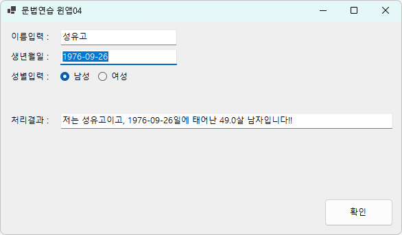
    2. 클래스와 객체, 메서드, 속성 - [소스](./day03/Day03Study/SyntaxWinApp01/Person.cs)
        - 객체를 생성하는 틀
        - 명사(멤버변수, 속성), 동사(멤버메서드)
        - Get/Set
    3. 접근제어자
        - `private` : 클래스 내에서만 접근가능
        - `public` : 어디서나 접근가능
        - protected : 내부, 자식 클래스에서만 접근가능
        - `internal` : 동일한 네임스페이스에서 public
        - internal protected : 동일한 네임스페이스에서 protected 기능
        - internal은 최근에 자동생성에서 자주 사용되고 있음

        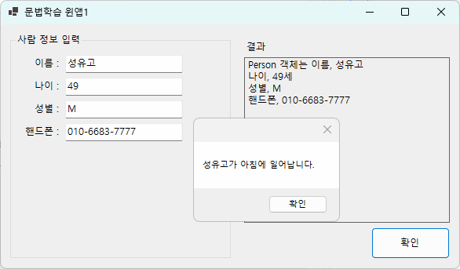

    4. 상속, 다형성, 추상클래스, 인터페이스 - [소스](./day03/Day03Study/SyntaxWinApp02/Computer.cs)
        - Java는 한 파일에 한 클래스 선호
        - C#은 한 파일에 클래스 여러개 생성 무방
        - 상속
            - 부모클래스에 자식객체 할당 가능
        - sealed : 더이상 상속을 하고 싶지 않을 때
        - is, as : 객체 타입을 비교, 형변환 키워드
        - System.Object : 모든 클래스의 조상
        - this : 클래스 자신. 현재는 사용 권장안함
        - base : 부모클래스 지칭. 현재는 사용권장안함
        - 다형성 오버라이드 : 부모 메서드를 재정의
            - 부모클래스와는 다르게 동작하고자 함
            - 추상 : 대략적인 틀만 가지고 있음
            - 이름과는 다르게 실행할 수 있는 능력부여
            - 부모메서드는 virtual(추상) 키워드
            - 자식메서드는 override 키워드            
        - 다형성 오버로드 : 같은 이름 메서드를 여러번사용
            - 파라미터 형태와 갯수에 따라 무한대로 같은 이름의 메서드를 생성가능
        - 인터페이스 : 계약관계 정의하고 구현없이 선언만 포함한 클래스의 일종
            - 추상클래스 개선한 방법
            - 추상클래스는 구현을 가질 필요가 없이 하위에서 상손된 자식클래스가 다시 구현하면됨
            - 문제는 추상클래스도 구현을 가지고 있어서, 이해도가 떨어짐
            - 다중 상속을 방지하기 위해서 인터페이스 사용
            - I인터페이스명 형태로 명명
            - 내부 메서드만 존재. 형태만 구성(구현X)
            - 인터페이스는 직접 코딩 말것
            - Alt+Enter > 인터페이스 구현 선택
            - 인터페이스는 사용 개수에 제약없음. 다중구현 대체

        - 얕은 복사, 깊은 복사
            - 얕은 복사 : 내부를 같이 참조하는 형태
            - 깊은 복사 : 완전히 새로 객체 생성 
        
        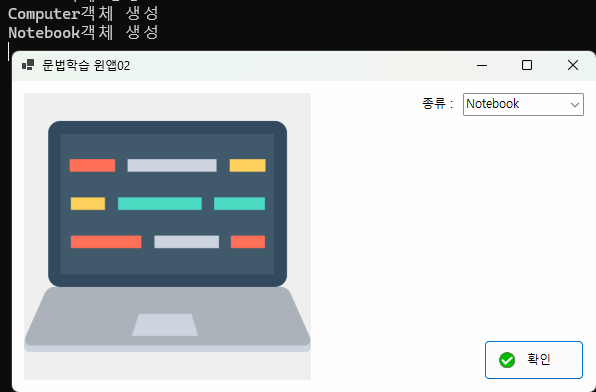

        - ref, out 키워드 > 차후에...
        - 열거형

## 4일차

### 윈앱 컨트롤 3
- `NumericUpDown` : 숫자 입력을 도와주는 컨트롤
    - Nud~ 이름으로 시작
    - 나머지는 Button과 동일
    - Minimum : 입력할 수 있는 최소값
    - Maximum : 최대값
    - Value : 현재값
    - 이벤트 생성 거의 안함

- `RichTextBox` : 포맷팅이 가능한 텍스트박스
    - MS Word, 한글워드프로세서 같은 문장 꾸미기, 페이지 꾸미기가 가능
    - Rtb~ 로 시작
    - ScrollBars : 컨트롤 오른쪽, 하단에 스크롤바 생성
        - Both 보다는 ForcedBoth, ForcedVertical 사용
    - WordWrap : 컨트롤 길이를 넘어가면 자동으로 줄바꿈 여부

- `OpenFileDialog` : 읽을 파일 위치와 파일을 선정하는 다이얼로그 창 컨트롤
    - 폼위에 표시되지 않는 컨트롤
    - DlgOpen 이름으로 사용
    - 코딩으로 설정내용 작성

- `SaveFileDialog` : 저장위치에 파일명 지정하는 다이얼로그 창 컨트롤
    - DlgSave 이름으로 사용
    - 코딩으로 설정내용 작성

- `ColorDialog` : 색상 선택하는 다이얼로그 컨트롤
    - DlgColor 이름사용
    - 코딩으로 설정내용 작성


- 대부분 컨트롤 속성
    - Anchor : 현재 컨트롤을 폼의 사이즈가 조정될 때 어디에 고정시키는지 설정
        - 왼쪽 상단에 있는 컨트롤 : 보통 Left, Top
        - 오른쪽 하단에 있는 컨트롤 : 보통 Right, Bottom
    - Dock : 어디 도킹시키는지 설정
        - Top, Left, Right, Bottom, Fill 
        - 보통 컨테이너 컨트롤용으로 사용
    - Anchor와 Dock 같이 사용해서 디자인
    - Font : 대표적인 폰트 사용할 것
        - 폼에서 변경하면 하위 컨트롤은 같이 변경

### VS 개발팁
- 코드조각(Code Snippet)을 최대한 활용(코딩양 줄임, 오타 예방)
- 보기 > 개체 브라우저에서 필요한 클래스 검색
- 소스코드가 회색으로 연하게 변하는 것 > 되도록이면 사용을 피하라는 뜻 > Alt+Enter로 변경권장사항 확인

### C# 문법
- 기본분법
    1. 형변환 - [소스](./day04/Day04Study/SyntaxWinApp01/FrmMain.cs)
        - 큰바이트 데이터형에 작은바이트 데이터형 값을 할당하면 문제없이 사용가능(묵시적 형변환)
        - `작은바이트 데이터형에 큰바이트 데이터형을 할당하면 문법적 오류` -> (명시적 형변환)
        - 명시적 형변환 : 실행중 예외발생은 개발자의 책임!!
        - 값 타입별 .parse(string) : 문자열을 해당 타입으로 변환
        - .TryParsse() : 추후 진행예정
        - Convert 클래스 사용 추천. 여러 타입을 다 변환가능
            - Convert.ToInt32()

    2. 예외처리
        - 실행중 비상종료를 막기위해서
        - try ~ catch ~ finally 구문으로 처리
        - 모든 예외의 부모클래스는 Exception 클래스
        - 예외클래스를 모르겠다 싶으면 Exception으로 처리

        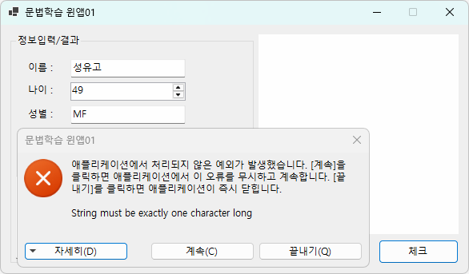
        
        https://github.com/user-attachments/assets/2aafb574-aebb-4703-94b1-dde4c8f4228b

    3. 컬렉션 - [소스](./day04/Day04Study/SyntaxWinApp02/FrmMain.cs)
        - 배열, 리스트, 딕셔너리, 큐, 스택 등 여러데이터를 저장하고 다루는 구조를 가진 객체를 통칭

        - 배열로 콤보박스에 데이터 할당
        - 리스트로 콤보박스 데이터 할당
        - 딕셔너리로 콤보박스 데이터 할당

        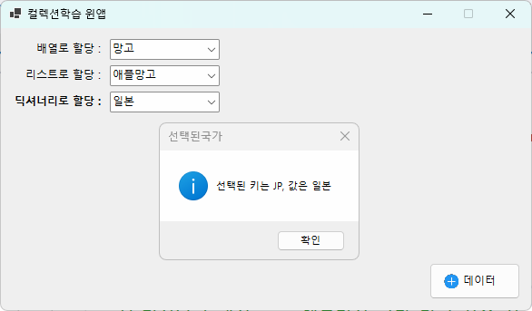

    4. 파일입출력 - [소스](./day04/Day04Study/SyntaxWinApp03/FrmMain.cs)
        - 파일 쓰기, 읽기 기능
        - SaveFileDialog, OpenFileDialog, ColorDialog 컨트롤 사용

        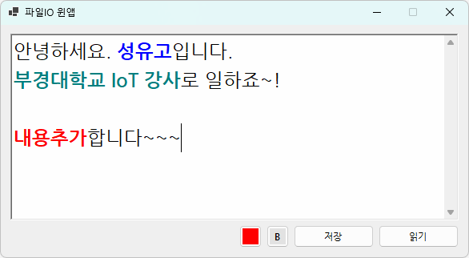

## 5일차

### 윈앱 컨트롤 4
- `StatusStrip` : 상태표시줄 컨트롤. 서브 컨트롤 추가 가능
    - 이름은 거의 변경 안함. 서브 컨트롤 이름을 변경
    - `StatusLabel` : 글자만 표시, Lbl~ 로 사용
    - `ProgressBar` : 진행바 표시, Prg~ 이름 시작
    - `DropDownButton` : 드롭다운버튼, 이벤트 추가
    - `SplitButton` : 버튼, 이벤트 추가
    - SizingGrip : 오른쪽 하단의 사이즈조절 아이콘 표시

### VS 사용팁
- 소스코드 들여쓰기 문제가 발생하면 > 편집 > 고급 > 문서서식 클릭

### C# 문법
- 기본 문법
    1. 델리게이트(대리자), 이벤트 - [소스](./day05/Day05Study/SyntaxWinApp01/FmMain.cs)
        - **대리자** : 메서드를 변수처럼 저장하고 호출할 수 있는 타입
            - C++/Java 함수포인터, 파이썬 콜백함수
        - 대리자는 실행할 메서드를 들고 있고, 대리자를 호출하면 대리자가 메서드를 대신 호출
        - 대리자는 호출할 메서드와 파라미터가 일치해야 함
        - 윈폼에서 버튼을 클릭하면, 직접 메서드를 호출하는게 아니고, C#이 사용자의 움직임을 체크하고 있다가 클릭`이벤트가 발생하면 그에 해당하는 메서드를 대신 실행(호출)`시켜주는 것

        - 대리자의 장점
            - 메서드를 변수처럼 저장
            - 런타임 시 메서드를 바꿀 수 있음
            - 하나의 대리자가 여러개의 메서드를 호출할 수 있음
        
        - Action, Func, Predicate 
            - 대리자 생략형

        - **이벤트** : 대리자의 특별한 형태. 어떤 일이 발생하면 연결된 메서드를 호출하는 것, PyQt의 `시그널`과 동일
            - 윈앱 버튼클릭, 마우스드래그, 타이머종료
            - 모바일, 윈앱, 웹앱 개발 모두 이벤트 덩어리 집합

        - 메서드 -> 대리자 -> 이벤트 -> 사용자가 연결해서 동작시킴
        - delegate : 메서드를 저장하고 실행하는 타입
        - event : delegate에게 '무슨일 발생하면 실행해!'라고 해주는 역할
        - +=, -= : 이벤트 구독(이벤트핸들러 연결), 이벤트 구독 해제

        - 자주 쓰이는 이벤트
            - Form_Load - 아래에 설명
            - Button_Click - 생략
            - TextBox_KeyPress - 생략
            - ComboBox_SelectedIndexChanged - 생략

        - Form 오픈 이벤트 및 생성자
            1. FrmMain 생성자 : 클래스 생성자
                - InitializeComponent() 객체(컨트롤)변수 초기화
            2. `FrmMain_Load` 이벤트 : 폼이 로드(메모리 업)될때 처리할 내용
                - 생성자 이외에 초기화 할 것 
                - 폼 오픈시 이벤트 중에서 가장 중요!!!
            3. FrmMain_Activated 이벤트 : 폼이 활성화(바탕화면 가장 위에서 동작하는 상태) 될때 처리될 이벤트
            4. FrmMain_Shown 이벤트 : 폼이 바탕화면에 그려질때 이벤트
                - 잘 안씀


        - Form 클로즈 이벤트
            1. FrmMain_FormClosing 이벤트 : 폼이 닫히는 도중 이벤트
            2. FrmMain_FormClosed 이벤트 : 폼이 완전히 닫힌 뒤 이벤트

        - 실제 실무에서는 
            - FrmMain() 생성자, FrmMain_Load(), FrmMain_FormClosing() 으로 대부분 작업

    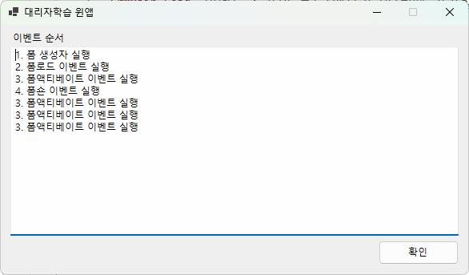

- 고급 문법
    1. 람다식 - C# 3.0부터 도입 - [소스](./day05/Day05Study/SyntaxWinApp02/FrmMain.cs)
        - 간단한 메서드를 한 줄로 표현하는 문법
        - 코드를 간결하게 작성하고 싶을 때 사용

    2. LINQ - C# 3.0부터 도입
        - Language Integrated Query : 언어에 통합된 쿼리
        - Database 학습 SQL과 유사
        - 데이터를 SQL처럼 Query 할 수 있는 문법

    3. 속성 - Property
        - 객체지향 클래스에서 멤버변수(명사) 중 public 변수
        - 첫번째 글자 대문자
        - { get; set; } 형태로 구성
        - 일반 클래스(멤버변수) : 객체 데이터 저장, 상태 표현
            - 코드로만 작성
        - UI 클래스(속성) : UI 상태나 외형, 기능 컨트롤
            - 폼 디자인, 코드 둘 다 사용
        - Form.Designer.cs 내용은 폼 디자인에서 마우스나 디자인 설정에 변경하는 값으로 되도록이면 수정하지 말 것
        - Form_Load 이벤트에 코딩으로 초기화

    4. partial 클래스 : C#에만 존재
        - 나누어진 같은 이름의 클래스를 컴파일시 하나로 합쳐주는 기능
        - 디자인에 관련된 소스코드는 *.Designer.cs로 분리
        - 기능에 필요한 소스코드만 *.cs로 분리

        ```cs
        // 1. FrmMain.cs
        public partial class FrmMain : Form
        {  

        // 2. FrmMain.Designer.cs
        partial class FrmMain
        {      

        // 3. FrmMain.resx 특이케이스  
        ```

    5. 제네릭 : Generic
        - 파이썬에는 필요없음 -> 타입지정이 자유로움
        - Java, C# 등의 엄격한 데이터타입 객체지향언어에 반드시 필요

        - 제네릭 메서드
        - 제네릭이 없으면,
        - 실제, Console.cs의 WriteLine()이 증거

        ```cs
        public void PrintInt(int data) { Console.WriteLine(data); }
        public void PrintString(string data) { Console.WriteLine(data); }
        public void PrintFloat(float data) { Console.WriteLine(data); }
        ```

        - 제네릭이 있으면,

        ```cs
        public void Print<T>(T data) { Console.WriteLine(data); }
        ```
        - 위 3개의 메서드를 아래의 하나의 메서드로 퉁칠 수 있음
        - 대문자 T는 아무거나 사용해도 무방. 대문자 한글자를 선호

        - 제네릭 클래스 
        - where T : class -> 참조형식(클래스)만 허용
        - where T : struct -> 값형식(기본 타입)만 허용
        - where T : new() -> 매개변수 없는 생성자 필요
        - where T : BaseClass -> 특정 클래스, 인터페이스 상속 필수

        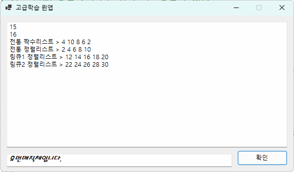

    6. 비동기, 스레드 - [소스](./day05/Day05Study/SyntaxWinApp03/FrmMain.cs)
        - UI 프로그램에 `응답없음` 발생
        - 멀티프로세스 - 한꺼번에 여러개의 프로세스를 실행
        - 스레드 - 프로세스에서 여러일을 한꺼번에 수행하기 위해 분리한 업무단위
        - 멀티스레드 - 한 프로세스에서 여러 스레드 동작하는 것
        - 응답없이 발생하면 프로그램의 신뢰도가 떨어짐
        - 윈앱 - 싱글 스레드(UI가 스레드를 제어)
        - 콘솔에는 실시간 출력, 텍스트박스, 프로그레스바 등 컨트롤 표시가 실시간으로 안됨
        
        - 첫번째 해결방법
            - Application.DoEvents() 메서드 추가. 권장X
        - 두번째 해결방법
            - 전통적인 스레드 사용. 권장하지만 난이도 상
        - `세번째` 해결방법
            - 비동기 async, await 키워드로 해결
            - 응답없음은 나타나지 않음. 진행바 처리        
            - 로직복잡해도 소스코드는 간결
        - `네번째` 해결방법
            - BackgroundWorker 클래스 사용 - 내일 처리
            - 최하 난이도
            - 이벤트 종류가 많아서 소스코드는 길이가 김

        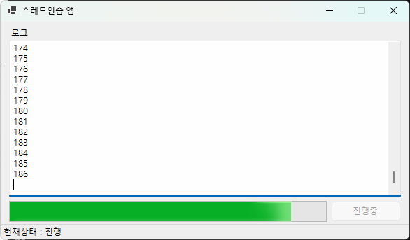

## 6일차

### 윈앱 컨트롤 5
- `BackgroundWorker` : 화면 뒷단에서 작업할 일중 스레드 처리가 되어야할 부분을 손쉽게 동작시켜주는  컨트롤(화면표시X)
    - Bgw~ 이름을 사용
    - 일반 속성은 잘 사용안함. 이벤트 3가지는 모두 사용
    - `DoWork` : 백그라운드(스레드) 작업 
    - `ProgressChanged` : UI상 변화를 처리 작업
    - `RunWorkerCompleted` : 작업완료시 대부분 UI완료 처리

- `CheckBox` : 여러개에서 다수를 선택할 수 있는 컨트롤(라디오버튼과 동작이 반대)
    - Chk~로 이름 사용
    - Checked : 선택 여부
    - CheckState :
        - Unchecked : 체크를 안한 상태
        - Checked : 체크한 상태
        - Intermediate : 모호한 상태(하위 체크가 일부는 체크, 일부는 체크안됐을때)
    - CheckedChanged : 기본이벤트, 체크상태가 변경되면 발생

- `TrackBar` : 사운드, 화면밝기등 최소, 최대를 스크롤로 조정하는 컨트롤
    - Trb~ 이름 사용
    - Minimum, Maximum : ProgressBar와 동일
    - TickFrequenccy : 간격표시 줄 간격
    - Scroll : 기본이벤트. 가로로 스크롤 이동시 발생하는 이벤트

- `TreeView` : 탐색기 하드디스크, 폴더 나타내는 부분과 동일한 컨트롤
    - Trv~ 
    - ImageList : 아이콘 이미지 설정
    - AfterSelect, AfterExpand, AfterCollapse 이벤트를 주로 사용

- `ListView` : 탐색기 오른쪽 목록을 표시하는 사용하는 컨트롤
    - Lsv~
    - View : LargeIcon, SmallIcon, List, Detail 등 탐색기 보기 기능과 동일
    - SmallImageList, LargeImageList로 아이콘 이미지 설정
    - SelectedIndexChanged : 아이템 선택이 변경될때 이벤트 발생

- `MonthCalendar` : 스케줄 등록을 위한 컨트롤
    - Cal~ 로 이름 사용
    - FirstDayOfWeek : 한주 시작일을 설정. default는 일요일 부터
    - DateChanged : 기본 이벤트, 날짜 변경시 발생       

- `DateTimePicker` : 단순 일자 선택하는 컨트롤
    - Dtp~ 로 이름 사용
    - 속성, 이벤트 거의 사용안함

- `LinkLabel` : 링크 클릭 컨트롤
    - 기존 Label 컨트롤과 유사
    - LinkClicked : 버튼과 같이 클릭하는 이벤트

- `MenuStrip` : 프로그램 메뉴관리
    - Mnu~ 이름시작. 사용하는 메뉴는 반드시 이름을 변경할 것 (예: 끝내기XMenustrip)와 같이 이름이 생성
    - 메뉴 이름 작성시 (&X)와 같이 사용하면 영문자아래 밑줄 표시
    - Click : 해당메뉴 클릭 이벤트

- `ToolTip` : 각 컨트롤에 툴팁아이콘 표시 컨트롤
    - 툴팁컨트롤 하나로 모든 컨트롤 툴팁 관리 가능
    - Form_Load에서 작성.

### C# 문법
- C# 기본
    - enum : 열거형, 필요한 목록의 수로된 키값을 문자로 변경해서 사용하는 구조체
        - 이진 &(And), |(Or) 연산으로 처리할때 효과적

        ```cs
        public enum FontStyle
        {
            Regular = 0,   // 일반 글씨.   0000
            Bold = 1,   // 굵은체,      0001
            Italic = 2, // 이탤릭,    0010
            Underline = 4, // 밑줄, 0100
            Strikeout = 8, // 취소선, 1000
        }
        ```

    - 모달창, 모달리스창 : 창위에 다른 창을 띄울때 접근권한 제어 형태
        - Modal : 부모창과 연관된 작업을 할때 사용. 모달창이 닫히지 않으면 부모창을 제어할 수 없음
        - Modaless : 부모창과 상관없이 동작. 메인창을 언제나 닫을 수 있고, 메인창은 받으면 모두 종료. 사용시 주의
        - 메시지박스 : 기본적으로 모달창으로 동작


### C# 마지막
- C# 고급
    1. 비동기, 스레드 - [소스](./day06/Day06Study/SynstaxWinApp01/FrmMain.cs)
        - BackgroundWorker 클래스 사용
        - .NET에 특화된 스레드사용 클래스
        - 전통적인 스레드를 쉽게 쓸 수 있게 변형
        - this.Invoke, async, await, Task등 사용할 필요없음
        - 취소 기능을 추가할 수 있음
        - 복잡한 비동기 작업이 많으면 Task 기반을 사용 권장      

### WinForms 응용
- 윈앱 응용개발
    - UI 컨트롤 예제 - [소스](./day06/Day06Study/WinControlsApp/FrmMain.cs)

    


## 7일차(04.28)

### C# 응용 - WPF
- WPF 개요
    - `Windows Presentation Foundation` 약자. 윈도우에서 표시하기위한 기초
    - 윈앱(윈폼즈)을 개선한 버전. 이미지 표현이 비트맵방식(2D). 용량문제, 계단현상 문제가 존재
    - 비트맵방식의 문제를 해결 -> 벡터방식(텍스트). 속도개선, 용량절약

- WPF 특징
    - WPF UI 디자인에는 이미지 `벡터`방식 사용. 비트맵방식도 혼용가능
    - `XAML` : xml기반의 디자인 문법으로 화면 UI를 디자인. PyQt와 동일
        - 안드로이드 등 모바일 개발, 자바 FX, Qt디자인 등 화면 UI의 최신 트렌드
    - HTML로 디자인하던 디자이너가 손쉽게 적용할 수 있음
    - 백엔드는 C# 윈앱과 거의 동일, 프론트엔드만 차이
        - 윈앱과는 다르게 코딩으로 디자인을 수행. 윈앱처럼 디자이너 사용 가능
        - 디자이너 -> Blend for Visual Studio 디자인툴 사용
        - 개발자 -> VS에거 코딩으로 디자인

    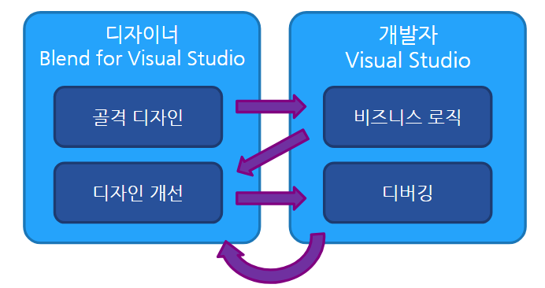
    
- XAML 
    - `eXtensible Application Markup Language` : XML 기반 언어
    - WPF(Windows), UWP(Win, Linux, MacOS), MAUI(모바일) 동일하게 사용
    - 태그형태로 디자인. <열린태크></닫힌태그>, <태그내 다른 태그없을때 />
    ```xml
    <Window x:Class="ex01_wpf_start.MainWindow"
            xmlns="http://schemas.microsoft.com/winfx/2006/xaml/presentation"
            xmlns:x="http://schemas.microsoft.com/winfx/2006/xaml"
            xmlns:d="http://schemas.microsoft.com/expression/blend/2008"
            xmlns:mc="http://schemas.openxmlformats.org/markup-compatibility/2006"
            xmlns:local="clr-namespace:ex01_wpf_start"
            mc:Ignorable="d"
            Title="MainWindow" Height="450" Width="800">
        <Grid>
            <Button x:Name="BtnClick" Content="CLICK" FontSize="40" FontFamily="NanumGothic" FontWeight="Bold" Click="BtnClick_Click" />
        </Grid>
    </Window>
    ```

- 각 프레임워크별 장점
    - 윈앱(윈폼) - 오래된 기술로 안정적. 상용/무료 서드파티 컨트롤이 많이 존재. 혼자 UI 개발할 때는 시간절약
    - WPF 
        - 비교적 최신기술. UI개발을 코딩으로 가능
        - MS가 출시하는 대부분의 윈앱이 WPF로 개발
        - UI 디자인이 매우 세련됨. 키오스크 등 개발에 많이 활용
        - 디자인 감각만 있으면 직접 컨트롤 제작이 용이
        - 디자이너와 개발자의 업무를 분리작업이 쉬움
        - GPU를 사용해서 GUI 렌더링을 해서 윈앱보다 성능이 뛰어남
        - 모바일, UWP 등도 동일하게 개발 가능

- WPF 컴포넌트(실무에서 쓰이는 UI컴포넌트, 윈앱도 존재) - Third Party
    - (상용)텔레릭 - https://www.telerik.com/ 
    - (상용)데브익스프레스 - https://www.devexpress.com/
    - (상용)인프라지틱스 - https://www.infragistics.com/
    - **(무료)마하앱** - https://mahapps.com/

### WPF 개발방법 및 컨트롤 1
- **WPF 애플리케이션** 선택  - [소스](./day07/Day07Study/WpfStudyApp01/MainWindow.xaml.cs)
    - 나머지는 동일

- WPF 프로젝트 구조
    - 종속성 : 필요한 라이브러리 관리
        - NuGet Package로 외부라이브러리 설치
    - App.xaml : 앱 실행을 관리하는 리소스
        - App.xaml.cs : 비하인드 C# 코드
        - 윈앱에 Program.cs와 동일
    - MainWindow.xaml : Form1.Designer.cs와 동일한 디자인 파일
        - MainWindow.xaml.cs : Form1.cs 소스코드와 동일

- WPF 기본개발은 윈앱과 거의 일치

- WPF 실제개발법(XAML) - [소스](./day07/Day07Study/WpfStudyApp02/MainWindow.xaml)
    - Window : 전체 partial 클래스
        - MainWindow.xaml.cs와 컴파일시 하나로 통합
    - UI작업, 레이아웃 설계부터 시작
    - **Grid** 컨트롤 : WPF에서 가장 많이 사용하는 레이아웃(중요!)
        - 내부에 위치하는 컨트롤이 그리를 채워서 표시
        - `Grid.Row`, `Grid.Column` : 그리드 상 컨트롤 위치할 행과 열 인덱스
        - Margin : 외부여백
            - 10 : 전체다 10의 공백을 여백
            - 10, 20 : 왼쪽/오른쪽 여백, 위/아래 여백
            - 10, 5, 20, 30 : 왼쪽, 위, 오른쪽, 아래 여백
        - Padding : 컨트롤 내부여백
        - 디자인할 창의 구역을 나눌때 사용

        ```xml
        <!-- Xaml에서 화면구역 나누기  -->
        <Grid.ColumnDefinitions></Grid.ColumnDefinitions>
        <Grid.RowDefinitions></Grid.RowDefinitions>
        ```
        - Widht/Height * : 배수
        - ColumnDefinition - Width에 숫자 + *
        - RowDefinition - Height에 숫자 + *
        - 숫자만 사용하면 크기 픽스
        - Row, Column를 세 부분으로 나눈뒤
        - 중앙 외는 고정된 값으로 지정
        - 외부 Grid와 내부 Grid로 나눠서 작업 수행

        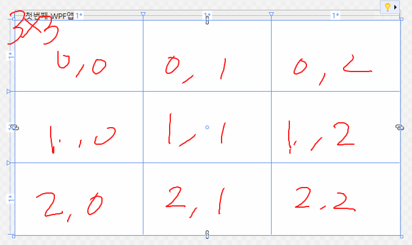

    - Responsive UI 사용 - WPF의 기본 디자인 정책

    - `StackPanel` : 스택처럼 컨트롤을 쌓는 레이아웃
        - `Orientation` : Vertical(기본), Horizontal
        - Padding 이 없음. 내부 컨트롤에 Margin 처리

    - DockPanel : 윈앱 Dock 속성과 동일
        - `DockPanel.Dock` : Left, Right, Top, Bottom

    - WrapPanel : 넓이 영역을 벗어나면 아래로 위치되는 레이아웃
        - 왼쪽부터 오르쪽으로 컨트롤 위치
        - 컨트롤 길이가 전체 넓이를 벗어나면 아래로 위치

    - `Canvas` : 컨트롤 자체 좌표를 제공하는 레이아웃
        - Canvas.Left, Right, Top, Bottom : 위치 
    
- 데이터바인딩 - [디자인](./day07/Day07Study/WpfStudyApp04/MainWindow.xaml), [소스](./day07/Day07Study/WpfStudyApp04/MainWindow.xaml.cs)
    - 바인딩 방법
        1. 컬렉션을 생성해서 데이터를 컨트롤에 할당
        2. DB에서 데이터 가져온뒤 컨트롤에 할당
    - 바인딩 방식
        1. 직접코드 할당방식 
            - CboCollection.ItemsSource = fruitItems
            - 기존 윈앱 방식과 동일
            - 메모리에 있는 fruitItems 데이터를 대입(할당)
            - DataContext와 관계 없음
            - 단순한 속성 사용방식
        2. XAML Binding방식 : MVVM 디자인패턴시 필수
            - {Binding fruitItems}
            - DataContext 기반으로 속성명 fruitItems를 검색
            - DataContext에 없으면 실패
            - BindingManager이 작업을 수행
            - DataContext는 컨트롤 자체에 할당해도 됨

    - ItemsSource : 각 컨트롤이 데이터를 바인딩하는 속성
    - DataContext : Xaml이 데이터를 어디에서 가져오는지 설정하는 속성
        - 데이터 한건만 설정X
        - 클래스 객체를 패키지로 전달 가능
    - 바인딩 순서
        1. WPF 바인딩 엔진은 DataContext 객체 안에서 public 접근제어자의 fruitItems라는 값을 검색
        2. this.DataContext 설정이 없으면 null 상태
        3. this.DataContext = this로 할당 ->  xaml로 전달

    - 바인딩 모드 : 총 4가지 모드. 그중 2가지만 알면됨
        1. `TwoWay` : 사용중인 데이터가 변경되면 <-> 원본도 변경
        2. `OneWay` : 원본데이터 -> 사용중인 데이터도 변경
        3. OneWayToSource : 사용중데이터 변경 -> 원본을 변경
        4. OneTime : 앱 시작시 최초에만 사용할 데이터에 업데이트

- 데이터베이스 데이터 바인딩
    1. `NuGet 패키지 관리자` - 파이썬 pip 역할
        - MySQL 검색 후
        - `MySQL.Data` 선택, 프로젝트 선택 후
        - 설치
    2. 콤보박스 추가
    3. 비하인드 코드에서 MySQL 소스 추가
        - DB연결문자열 : connectionString
        - 쿼리문자열 : query
        - DB연결객체 : MySqlConnection
        - 명령실행객체 : MySqlCommand(쿼리문 실행)
        - 실행결과리더객체 : MySqlDataReader(쿼리결과 데이터)
        - 트랙잰셕객체 : 옵션. 트랜잭션 처리시 필요

    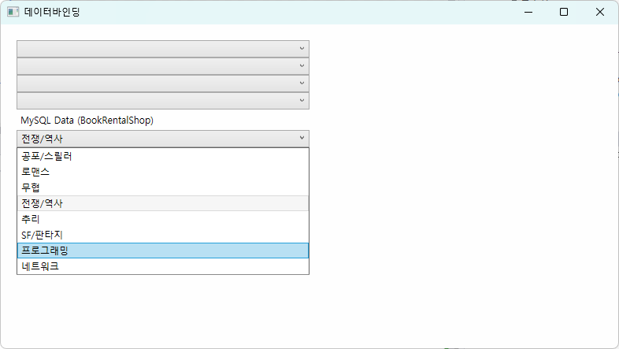


## 8일차

### WPF 개발방법 및 컨트롤 2
- 데이터베이스 데이터 바인딩
    - Xaml Binding 방식

- 네비게이션
    - 화면 전환 

- 컨트롤 디자인, 리소스
    - 

## 9일차

### C# 응용 - WPF
- WPF 기본 

## 10일차

### 코딩테스트
